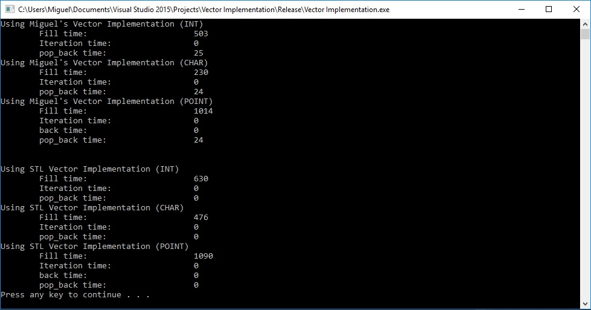

# Custom Vector Implementation
A custom vector implementation, similar to the C++ STL vector. Uses Google Tests for testing.

<h2>Matches C++ STL vector</h2>
- Works with custom built types
- Dynamic resizing when inserting elements
- Implements iterators

<h2>Advantages Over C++ STL vector</h2>
- Slightly faster times when inserting built in types and almost identical times when inserting custom types.

<h2>Disadvantages Over C++ STL vector</h2>
- Slower popping times.

<h2>Timed Test</h2>
Below is a timed test for inserting 25 million random ints, chars, and points.

<h2>Google Tests</h2>
Google Tests was used for unit testing in the project.

<h2>Implemented Methods</h2>
<h3>Constructors</h3>
- Vector();
- explicit Vector(size_t s);
- Vector(const Vector& arg);
- Vector<T>& operator=(const Vector<T>& arg);
- ~Vector();
<h3>Iterators</h3>
- iterator begin();
- const iterator begin() const;
- iterator end();
- const iterator end() const;
- const iterator cbegin() const;
- const iterator cend() const;
<h3>Capacity</h3>
- bool empty() const;
- size_t capacity() const;
- void reserve(size_t);
- void resize(size_t, T = T());
- size_t size() const;
- size_t max_size() const;
<h3>Modifiers</h3>
- void clear();
- void push_back(constT&);
- void pop_back();
<h3>Element Access</h3>
- T& at(size_t n);
- const T& at(size_t n) const;
- T& operator;
- const T& operator const;
- T& front();
- const T& front() const;
- T& back();
- const T& back() const;
- T* data();
- const T* data() const;
